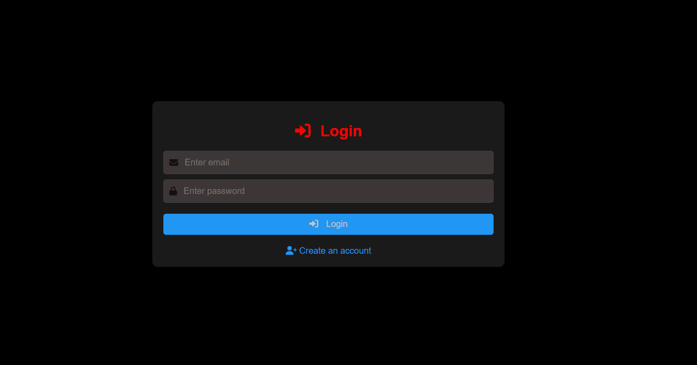
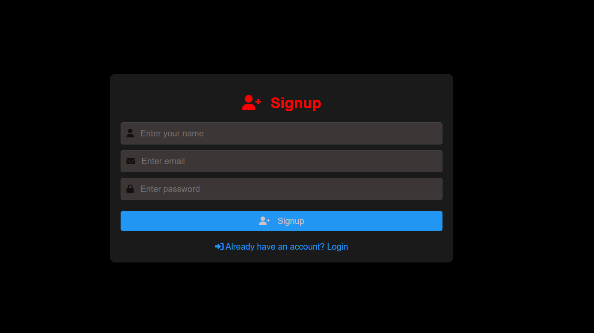
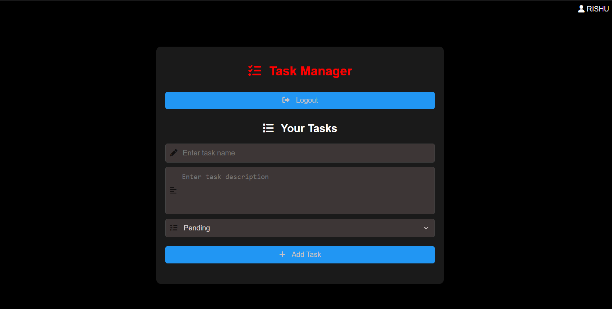

# Task Manager

A simple and intuitive task management application built with **Node.js**, **Express**, **MySQL**, and **vanilla JavaScript**. This project allows users to sign up, log in, and manage their tasks efficiently.

---

## Features

### **User Authentication**
- Sign up with name, email, and password.
- Log in with email and password.
- JWT-based authentication for secure access.

### **Task Management**
- Add new tasks with a name, description, and status.
- Edit existing tasks.
- Delete tasks.
- Track task status: **Pending**, **In Process**, or **Completed**.

### **User-Friendly Interface**
- Clean and modern design.
- Responsive layout for all devices.
- Icons and visual indicators for better usability.

---

## Screenshots

### Login Page  


### Signup Page  


### Task Manager Page  


---

## Technologies Used

### **Frontend**
- HTML, CSS, JavaScript
- [Font Awesome](https://fontawesome.com/) for icons

### **Backend**
- Node.js
- Express.js
- MySQL (for database)

### **Authentication**
- JSON Web Tokens (JWT) for secure user authentication

### **Other Tools**
- Git for version control
- GitHub for hosting the repository

---

## Installation

Follow these steps to set up the project locally:

### **1. Clone the Repository**
```sh
git clone https://github.com/Rishu88777/task_manager_web.git
cd task_manager
```

### **2. Set Up the Backend**
Navigate to the backend folder:
```sh
cd backend
```
Install dependencies:
```sh
npm install
```

Create a `.env` file in the backend folder and add your database credentials:
```sh
DB_HOST=localhost
DB_USER=your_mysql_username
DB_PASSWORD=your_mysql_password
DB_NAME=task_manager
SECRET_KEY=your_jwt_secret_key
```

Set up the database:
```sql
CREATE DATABASE task_manager;
USE task_manager;

CREATE TABLE users (
    id INT AUTO_INCREMENT PRIMARY KEY,
    name VARCHAR(255) NOT NULL,
    email VARCHAR(255) UNIQUE NOT NULL,
    password VARCHAR(255) NOT NULL
);

CREATE TABLE tasks (
    id INT AUTO_INCREMENT PRIMARY KEY,
    user_id INT NOT NULL,
    name VARCHAR(255) NOT NULL,
    description TEXT,
    status ENUM('Pending', 'In Process', 'Completed') DEFAULT 'Pending',
    FOREIGN KEY (user_id) REFERENCES users(id) ON DELETE CASCADE
);
```

Start the backend server:
```sh
npm start
```

### **3. Set Up the Frontend**
Open the frontend folder:
```sh
cd ../frontend
```
Open `index.html` in your browser to access the application.

---

## Usage

### **Sign Up**
1. Click the **Signup** button on the homepage.
2. Enter your **name, email, and password** to create an account.

### **Log In**
1. Click the **Login** button on the homepage.
2. Enter your **email and password** to log in.

### **Manage Tasks**
- **Add** new tasks using the task form.
- **Edit** or **delete** tasks using the respective buttons.
- **Track** task status using the dropdown menu.

### **Log Out**
- Click the **Logout** button to securely log out of your account.

---

## Folder Structure
```
task-manager/
├── backend/
│   ├── db.js              # Database connection
│   ├── server.js          # Backend server
│   ├── routes/            # API routes
│   │   ├── authRoutes.js  # Authentication routes
│   │   └── taskRoutes.js  # Task management routes
│   └── middleware/        # Middleware functions
│       └── authMiddleware.js
├── frontend/
│   ├── index.html         # Homepage
│   ├── login.html         # Login page
│   ├── signup.html        # Signup page
│   ├── taskmanager.html   # Task manager page
│   ├── styles.css         # CSS styles
│   └── app.js             # Frontend JavaScript
├── screenshots/           # Screenshots for README
├── README.md              # Project documentation
└── .gitignore             # Files to ignore in Git
```

---

## License

This project is licensed under the **MIT License**. See the [LICENSE](LICENSE) file for details.

---

## Contact

If you have any questions or feedback, feel free to reach out:

📧 **Email**: rishushrivastava264@gmail.com  
🐙 **GitHub**: [Rishu88777](https://github.com/Rishu88777)  
🔗 **Project Link**: [Task Manager](https://github.com/Rishu88777/task_manager_web)

